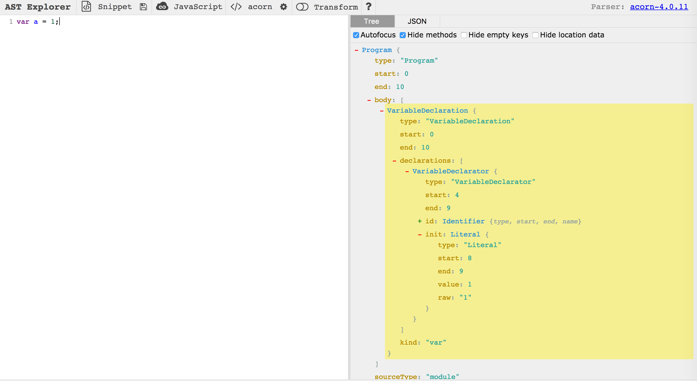

# V8 中 AST 抽象语法树

> AST：抽象语法树，通过构建语法树的形式将源代码中的语句映射到树中的每一个节点上。

### 什么是语法树

通过一个例子 ```var a = 1;```  来看看它的语法树长什么样子。



我们可以发现，程序代码本身可以被映射成一棵语法树，而通过操作语法树，我们可以获取程序代码中的节点。

### AST

AST对象都是基于 Zone 进行内存管理的，基于 Zone 配置，V8 封装了 ZoneObject来作为 AST 对象的基类。AstNode 继承自 ZoneObject，是所有语句、表达式和声明的基类。


AstNode 的子类有4个大类：

* Statement: 语句（if、try catch、with 等）
* Expression: 表达式
* Decalration: 声明（变量声明、函数声明、import 导入，export 导出）
* Module: ES6 新增的模块

再回头看看最开始的例子中```var a = 1;```，它的语法树类型就是 VariableDeclaration（变量声明）。

### 工具

我们可以使用 [AST Explorer](https://astexplorer.net/) 来生成 AST 语法树。